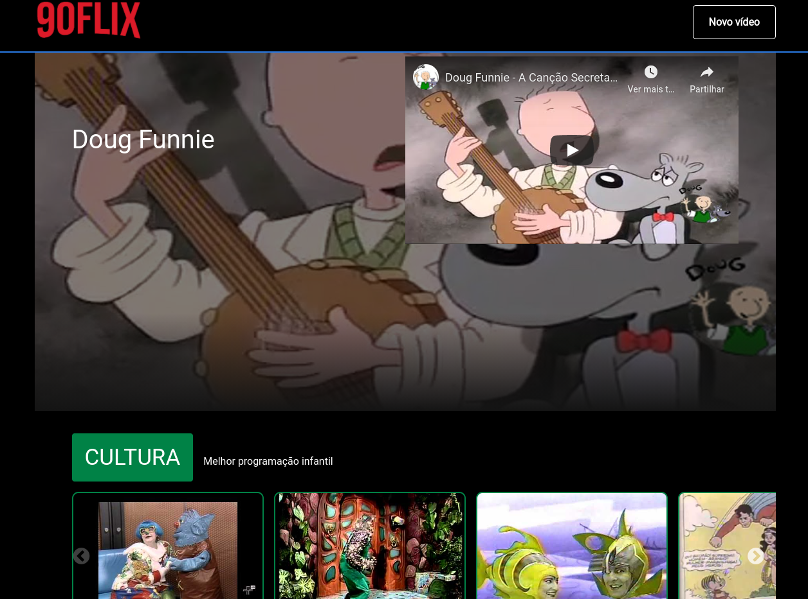

## 90FLIX

  
  
  

## About this project

A NETFLIX alike website with Brazilian 90's children TV shows using Create React App with hooks, page routing and more.

#What I used on this project

React routing, Hooks, React Components, Styled-components, PropTypes

# Created during Imersão React da [Alura](https://www.alura.com.br/)

Please check the [live website](https://90flix.vercel.app/)

<!-- [OnPortfolio](https://front-end-portfolio.vercel.app/) -->
